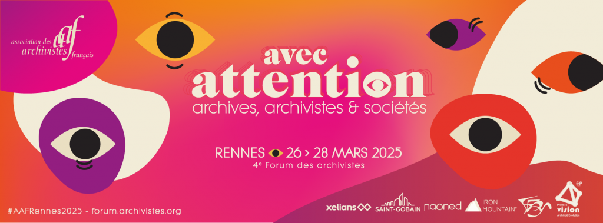

# Que trouverez-vous sur ce repo ?

Ce repo contient le code du site réalisé dans le cadre d'une intervention durant le Forum des archivistes 2025, organisé par l'Association des Archivistes Français à Rennes.

Cette intervention porte le titre "Il faut que tout bouge pour que rien ne change" et elle porte sur les liens entre les archives et les infrastructures, en particulier de la connaissance.

Pour accéder au site : [https://aldonzel.github.io/intervention-forum-AAF25/](https://aldonzel.github.io/intervention-forum-AAF25/)

